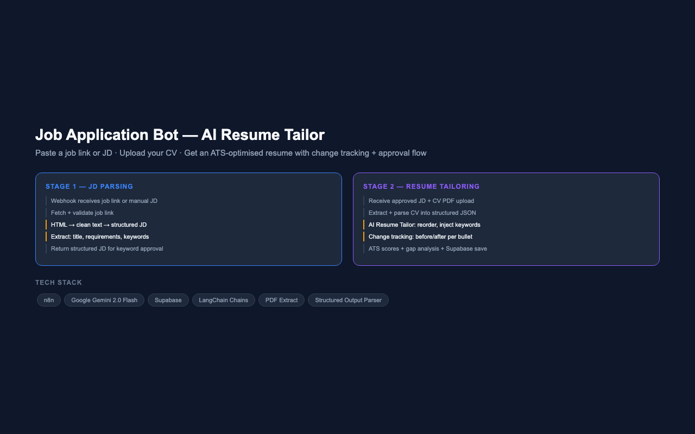

# Job Application Bot — AI Resume Tailor with Approval Flow

**Paste a Job Link · Upload Your CV · Get an ATS-Optimised Resume with Change Tracking · Built on n8n + Gemini + Supabase**

---



---

## Overview

An end-to-end AI resume tailoring system that takes a job description (via link or paste) and a candidate's CV (PDF), then produces an optimised resume with full change tracking, ATS scores, gap analysis, and missing keyword flags — all presented for candidate approval before anything is finalised. Built as a two-stage webhook workflow with Supabase persistence and multiple Gemini models orchestrated via LangChain chains.

---

## Problem Statement

Job seekers submit generic CVs that fail ATS filters and never reach a hiring manager. Manually tailoring a resume for each role is time-consuming, inconsistent, and hard to audit. There was no automated system that could parse a JD, map it against a candidate's actual experience, rewrite bullets with tracked changes, and flag gaps — all without hallucinating experience that doesn't exist.

---

## Workflow Architecture

### Stage 1 — JD Parsing & Keyword Approval

```
POST /job-application  (stage: "start")
        │
        ▼
┌──────────────────────────┐
│   Switch (stage router)  │  ← Routes "start" vs "approved"
└────────┬─────────────────┘
         │ start
         ▼
┌──────────────────────────┐
│   Normalize Input        │  ← Extract job_link, manual_jd, cv_doc_link
└────────┬─────────────────┘
         │
         ▼
┌──────────────────────────┐
│   If (job_link present?) │
│   ├── Yes → Fetch URL    │  → Check valid → Strip HTML → Extract text
│   └── No  → Manual JD   │  → Pass through directly
└────────┬─────────────────┘
         │
         ▼
┌──────────────────────────────────────────┐
│   HTML to Text (Gemini LLM Chain)         │  ← Normalise section headings
│   → Basic LLM Chain (Gemini)              │  ← Convert to structured JSON
│   → Parse Structured JD                  │  ← title · about · requirements
│                                           │     responsibilities · keywords
└────────┬──────────────────────────────────┘
         │
         ▼
┌──────────────────────────┐
│  Respond: structured JD  │  ← Candidate reviews keywords before Stage 2
└──────────────────────────┘
```

### Stage 2 — Resume Tailoring

```
POST /job-application  (stage: "approved")
        │
        ▼
┌──────────────────────────┐
│   Extract from File      │  ← Parse PDF CV
└────────┬─────────────────┘
         │
         ▼
┌──────────────────────────────────────────┐
│   CV Chain (Gemini)                       │  ← Structured Output Parser
│   → name · headline · summary            │     returns typed JSON
│   → skills · tools · experience          │
│   → education                            │
└────────┬──────────────────────────────────┘
         │
         ▼
┌────────────────────────────────────────────────────────┐
│   Resume Tailor (Gemini LLM Chain)                      │
│   ├── Assess: direct match / lateral / career pivot     │
│   ├── Reorder bullets for JD relevance                  │
│   ├── Inject keywords naturally from JD keyword list    │
│   ├── Rewrite weak bullets with stronger action verbs   │
│   ├── Track EVERY change with before/after + reason     │
│   └── Score: ATS · overall match · confidence           │
└────────┬───────────────────────────────────────────────┘
         │
         ▼
┌──────────────────────────┐
│   Code (JavaScript)      │  ← Parse output · build scores/insights
└────────┬─────────────────┘
         │
         ├──→ Respond to Webhook (return result to frontend)
         │
         └──→ Supabase: Create row (persist session)
```

---

## Change Tracking System

Every modification to the resume is logged with a unique change record:

| Field | Description |
|---|---|
| `change_id` | Unique integer per change |
| `change_type` | KEYWORD_ADDED · BULLET_IMPROVED · BULLET_REORDERED · SUMMARY_REWRITTEN · SKILL_ADDED |
| `field` | Exact location (e.g. `experience[0].key_points[2]`) |
| `before` | Original text |
| `after` | New text |
| `reason` | Why this improves ATS or relevance |
| `approved` | null until candidate confirms |

---

## Scoring Output

| Score | Description |
|---|---|
| Overall Match Score | % fit between CV and JD |
| ATS Score | Keyword presence, structure, action verbs, quantified achievements |
| Confidence Score | 0.8–1.0 direct match · 0.5–0.8 lateral · 0.0–0.5 career pivot |
| Improvement Delta | Before vs after on match and ATS scores |

---

## Safety Rules (Hard-Coded in Prompt)

- Never invent experience, metrics, or achievements
- Never add tools not mentioned in the CV or candidate's additional points
- All improvements must be grounded in candidate-provided data only

---

## Tech Stack

| Component | Technology |
|---|---|
| Workflow Orchestration | n8n |
| LLM | Google Gemini 2.0 Flash (multiple instances) |
| Agent Framework | n8n LangChain Chains + Structured Output Parser |
| PDF Parsing | n8n Extract from File node |
| Persistence | Supabase (sessions table) |
| Trigger | Webhook (POST, two-stage) |
| HTML Parsing | JavaScript Code Node |
