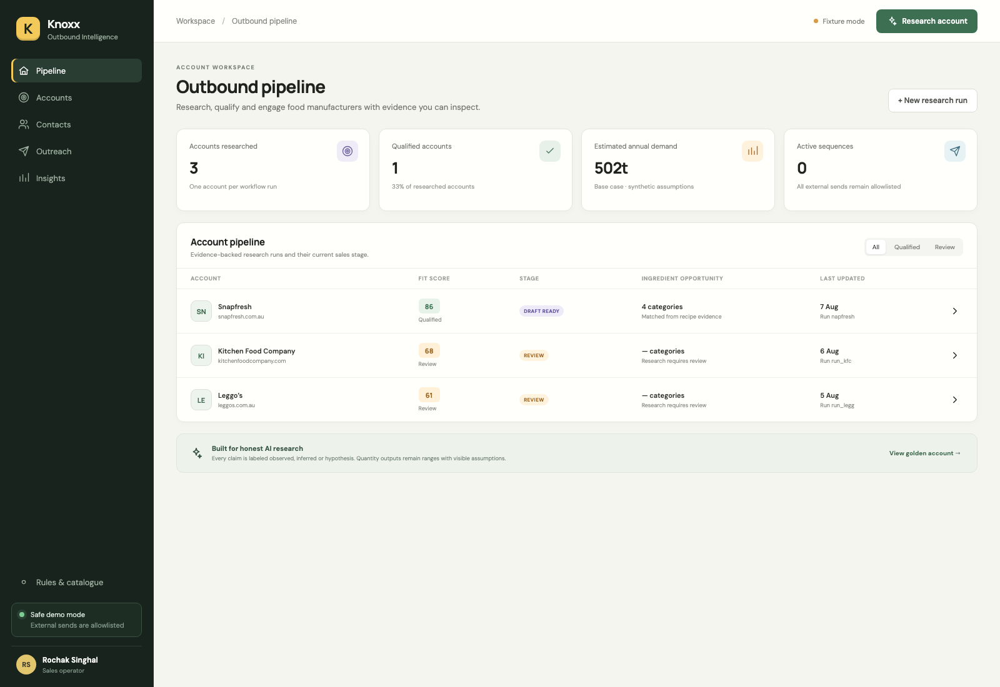
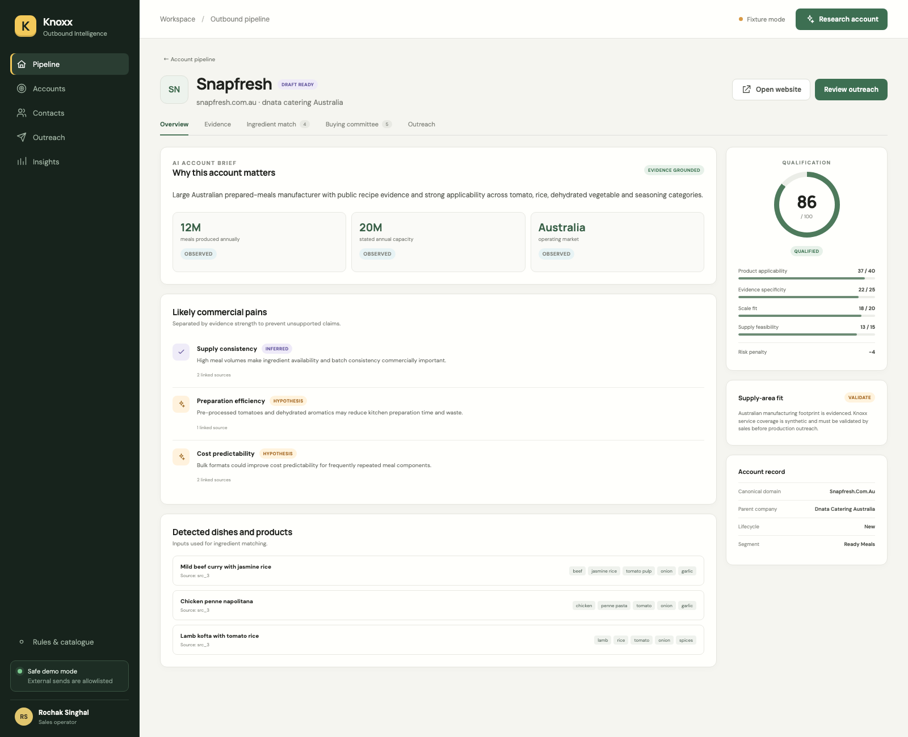
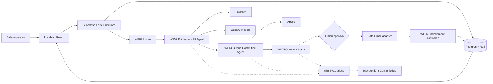

# Knoxx Outbound Intelligence

Portfolio-ready account research, ingredient opportunity qualification and safe outreach orchestration. One run investigates one company and preserves its evidence, decisions and outcomes for future lookalike analysis.





## What the reviewer can do

1. Enter a company website.
2. See an evidence-backed account report: dishes, service feasibility, scale, pain hypotheses, Knoxx matches and low/base/high demand.
3. Review an explainable qualification score and 3–5 ranked buying-committee contacts.
4. Edit and approve a four-touch sequence.
5. Send only to a configured test inbox and simulate clicks, replies, bookings, bounces and opt-outs.
6. Watch account-level stop rules update the pipeline.

The frontend runs with golden fixtures when Supabase environment variables are absent, making the portfolio demo safe and reproducible.

## Architecture



Editable Miro board source, including state machines and agent boundaries, is in [`docs/miro-architecture.md`](docs/miro-architecture.md).

The polished standalone diagram is available as [`architecture-clean.svg`](docs/architecture-clean.svg) and [`architecture-clean.png`](docs/architecture-clean.png). Import either image into Miro; no Miro connector or API is required.

## Interview pack

- [Interview pack index](docs/INTERVIEW-PACK.md) — share links, reading order and the exact files to open
- [Start here](docs/START-HERE.md) — exactly which file to use for presentation, frontend, architecture and preparation
- [Final 16:9 PowerPoint](docs/Knoxx-Outbound-Intelligence-Interview.pptx)
- [Online Google Slides presentation](https://docs.google.com/presentation/d/1rv1xUF5RiuSoF6CzxqHfBlhyvNNfFVDlW1JK5qAW9HM/edit) — revised interview deck
- [Gamma-ready Markdown source](docs/interview-deck-gamma.md) — paste into Gamma manually; a paid Gamma API is not required
- [Gamma master prompt](docs/gamma-master-prompt.md) — visual/content instructions to paste before the Markdown source
- [Interview-ready reading guide](docs/interview-ready-guide.md) — concise product story, workflow, four case answers, scale and tough Q&A
- [CPO review](docs/CPO_REVIEW.md) — pilot verdict, product critique and changes made
- [Lovable master build prompt](docs/lovable-master-prompt.md) — explicitly locks the existing Supabase project
- [Lovable live connection fix](docs/lovable-live-connection-fix.md) — sets the missing production publishable key and corrects metadata/session states
- [End-to-end workflow and interview guide](docs/workflow-interview-guide.md)
- [Ten-minute demo script](docs/demo-script.md)

Live frontend: [knoxx-insight-quest.lovable.app](https://knoxx-insight-quest.lovable.app). The production Supabase integration is merged into the Lovable-connected GitHub `main` branch; the published Lovable snapshot must be refreshed once with **Publish → Update**. The deck uses the version-controlled architecture visual, so a Miro board is optional.

## Repository map

```text
frontend/              React portfolio app and deterministic engine tests
supabase/migrations/   Postgres schema, indexes, RLS and functions
supabase/functions/    Protected runtime interfaces and tracked CTA
n8n-workflows/         Importable workflow JSON exports
evaluation-data/       Golden cases for native n8n Evaluations
docs/                  Miro-ready architecture and demo material
```

## Local frontend

```bash
cd frontend
npm install
npm test
npm run dev
```

Copy `.env.example` to `.env.local` only when connecting Supabase. Never place service-role, Apollo, model, Gmail or Firecrawl credentials in the browser environment.

Run the complete local contract, Edge Function, frontend and security verification with:

```bash
npm run verify
```

The latest verification scope and the remaining live-provider checks are documented in [`TEST_REPORT.md`](TEST_REPORT.md).

## Supabase setup

Apply every file in `supabase/migrations/` in numeric order, then `supabase/seed.sql`. Deploy the five Edge Functions and configure:

```text
SUPABASE_URL
SUPABASE_ANON_KEY
SUPABASE_SERVICE_ROLE_KEY
N8N_ACCOUNT_RESEARCH_WEBHOOK
N8N_SEQUENCE_WEBHOOK
N8N_WEBHOOK_SECRET
OUTREACH_EVENT_SECRET
MEETING_URL
TRACKING_BASE_URL
TRACKING_SIGNING_SECRET
```

The anon key is safe for the browser only with RLS enabled. The service-role key stays in Edge Function/n8n secrets.

## n8n import order

1. `WF06-engagement-controller.json`
2. `WF05-outreach-strategy-safe-send.json`
3. `WF04-buying-committee.json`
4. `WF02-account-intelligence-fit.json`
5. `WF01-account-intake-orchestrator.json`

Replace every `REPLACE_WITH_*` credential/data-table identifier. Configure the variables listed in `n8n-workflows/README.md`, import the evaluation CSVs into n8n Data Tables, validate each workflow, then test while `DEMO_MODE=true`.

## Safety boundary

- No real-prospect delivery in demo mode.
- The Gmail adapter overrides every recipient with `SAFE_TEST_EMAIL`.
- The intended recipient is retained only for reviewer context.
- The agent cannot approve or send.
- Clicks do not stop outreach; confirmed engagement does.
- Suppressed contacts cannot be queued.
- Credentials and real contact data are excluded from the repository.

Before production delivery, record consent or reviewed lawful basis, implement authenticated sending domains and confirm jurisdiction-specific requirements. Australia’s ACMA requires consent, sender identification and functional unsubscribe handling for commercial messages; Gmail applies authentication and additional controls to bulk senders. See [ACMA spam guidance](https://www.acma.gov.au/avoid-sending-spam) and [Gmail sender guidelines](https://support.google.com/mail/answer/81126).

## Model and provider notes

See [`MODEL_DECISIONS.md`](MODEL_DECISIONS.md) for per-stage routing and promotion thresholds. Firecrawl is used because it returns bounded website/PDF content with source metadata; Apollo people search and person enrichment remain separate operations. See [Firecrawl scrape](https://docs.firecrawl.dev/api-reference/endpoint/scrape), [Apollo People Search](https://docs.apollo.io/reference/people-api-search), and [Apollo People Enrichment](https://docs.apollo.io/reference/people-enrichment).

## Known limitations

- Golden outputs and catalogue/history data are synthetic.
- Public-site research can be incomplete or stale; all meaningful claims retain evidence status.
- Quantity is a range, not a purchase forecast.
- Apollo coverage varies by account and jurisdiction.
- CRM sync, lookalikes, LinkedIn automation, opted-in WhatsApp and production sending are deferred.
- The live Supabase project proves contact ranking, a four-touch sequence, tracked click, Gmail positive reply and organization-wide pause. The newest live research run remains `running`, an older run is `failed_partial`, and live evidence/ingredient rows are not yet complete. The fixture account report is therefore an expected-output demonstration, not live Firecrawl persistence proof.

## Interview question 4 — scaling to 1,000+ account requests

The demo proves the product loop; a production system must separate accepting work from performing expensive research. “1,000 requests” must also be qualified as a burst, per day, or concurrently. The design below accepts a burst immediately, gives every request a durable `run_id`, and processes it at the rate allowed by worker capacity and provider quotas.

### Existing-account awareness

The canonical domain is the account identity. Intake checks `account_aliases` and `accounts` before creating anything. If sales has already researched the company, the UI should show the assigned rep, previous runs, last research date, current stage, contacts attempted, outcomes and suppression state. A new request creates an immutable `research_run` on the existing account rather than duplicating the company.

For simultaneous submissions, use a database uniqueness rule for one active run per workspace/domain/input version. The second request can reuse the active job unless the user explicitly requests a fresh run. Tenant boundaries must be part of every uniqueness rule so one workspace never learns about another workspace’s accounts.

### Asynchronous production architecture

1. Intake validates the URL, resolves the canonical domain, writes the account/run transaction and returns `202 Accepted` with a `run_id`; it does not wait for crawling or an LLM.
2. A durable queue creates separate jobs for retrieval, extraction, qualification, contact discovery and outreach drafting. Supabase Queues is Postgres-native and supports durable delivery, visibility timeouts and archival/replay. See [Supabase Queues](https://supabase.com/docs/guides/queues) and [PGMQ](https://supabase.com/docs/guides/queues/pgmq).
3. n8n workers consume jobs with bounded concurrency. Retrieval, LLM and Apollo work have separate concurrency/rate-limit budgets so one constrained provider cannot block every workflow. A production n8n deployment can use queue mode and worker concurrency; see [n8n queue mode](https://docs.n8n.io/hosting/scaling/queue-mode/) and [concurrency control](https://docs.n8n.io/hosting/scaling/concurrency-control/).
4. The UI polls or subscribes to persisted stages: `queued`, `researching`, `failed_partial`, `review`, `qualified` and `completed`. A user can therefore submit multiple accounts without holding browser or webhook connections open.
5. Scheduled outreach moves from long-lived Wait executions to a dispatcher that claims due messages in short transactions. PostgreSQL remains the source of truth; the queue determines what work runs next.

### Failure, update and delete behaviour

- Every stage has an idempotency key such as `run_id:stage:input_version`; repeated webhooks cannot duplicate a state change or send.
- Retry transient `429` and `5xx` failures with exponential backoff, jitter and provider `Retry-After` guidance. Firecrawl explicitly recommends this for rate/concurrency failures. See [Firecrawl error handling](https://docs.firecrawl.dev/api-reference/errors).
- Treat authentication, invalid input and schema failures as permanent until corrected. Exhausted jobs go to a dead-letter/review queue while the run remains `failed_partial` with its completed checkpoints intact.
- Use short database transactions, optimistic version checks and append-only audit events for updates. Soft-delete user-facing records first; retain required suppression and audit records. Raw crawl/PDF payloads move to object storage while Postgres stores source metadata and content hashes.
- Index workspace/domain lookup, run status/creation time, due-message status/schedule, and event idempotency. Partition high-volume engagement/audit tables only when measurements justify it.

### Capacity and backpressure

As an illustrative target, clearing 1,000 full research jobs during an eight-hour day requires about `2.1 jobs/minute`. If a full run occupies a worker for three minutes, average concurrency is about `6.3`; provision roughly 10–15 worker slots for variance, then cap each provider separately. A burst of 1,000 is queued rather than interpreted as 1,000 simultaneous Firecrawl, LLM or Apollo calls.

Apollo limits vary by endpoint and plan, and enrichment consumes credits when qualifying data is returned. The worker reads the workspace’s current limits and enriches only the top one or two candidates after a cheaper search/ranking pass. See [Apollo rate limits](https://docs.apollo.io/reference/rate-limits) and [API pricing and credits](https://docs.apollo.io/docs/api-pricing).

### Cost model

Do not promise an invented dollar figure before a measured pilot. Instrument this equation instead:

```text
variable cost/account =
  pages retrieved × retrieval price
  + LLM input tokens × input-token price
  + LLM output tokens × output-token price
  + successful enrichment units × enrichment price
  + email/event/storage usage

monthly cost =
  fresh runs × cost/fresh run
  + reused runs × cost/revalidation
  + fixed database, queue, worker and observability cost
```

The strongest cost controls are product decisions:

- Reuse evidence within a sales-approved freshness window and invalidate it by content hash, catalogue version or qualification-rule version.
- Crawl a bounded set of relevant menu, product, location and PDF pages rather than the whole domain.
- Use a fast economical model for extraction/classification and escalate only ambiguous or high-value cases to a stronger model.
- Keep arithmetic, fit thresholds, suppression and workflow state deterministic.
- Search broadly but enrich only the top one or two contacts; stop all downstream spend on disqualified accounts.
- Assign per-run page, token, enrichment and retry budgets, then route overruns to review.

For planning, if 30% of 1,000 daily requests can reuse fresh account evidence, capacity and provider spend should be modelled as 700 full runs plus 300 lightweight revalidations—not 1,000 full crawls. The pilot dashboard should report cost per started, completed and qualified account so sales can compare spend with research time saved and pipeline created.

### Production-readiness gates

- Load-test a 1,000-job burst and verify queue age, throughput and database connection headroom.
- Chaos-test provider timeouts, `429`s, malformed model JSON, duplicate webhooks and worker restarts.
- Monitor p50/p95 stage latency, queue depth/oldest age, completion and partial-failure rates, provider throttling, retry/dead-letter counts, cache-hit rate and cost per qualified account.
- Trace every provider call and state transition by `run_id`; alert on stuck runs and due-message lag.
- Run frozen evaluations for prompt/model/catalogue changes and sample production outputs for drift.
- Add workspace RLS, least-privilege credentials, protected webhooks, secret rotation, backups/PITR, retention rules and a tested restore procedure before real customer data or delivery.

The concise interview answer is: **accept quickly, deduplicate by canonical account, queue every expensive stage, persist checkpoints in Postgres, enforce idempotency and provider-specific backpressure, reuse fresh evidence, and measure unit cost per qualified account rather than quoting an untested per-request number.**

## Reviewer walkthrough

Use [`docs/demo-script.md`](docs/demo-script.md) for the ten-minute interview demonstration and failure scenarios.
