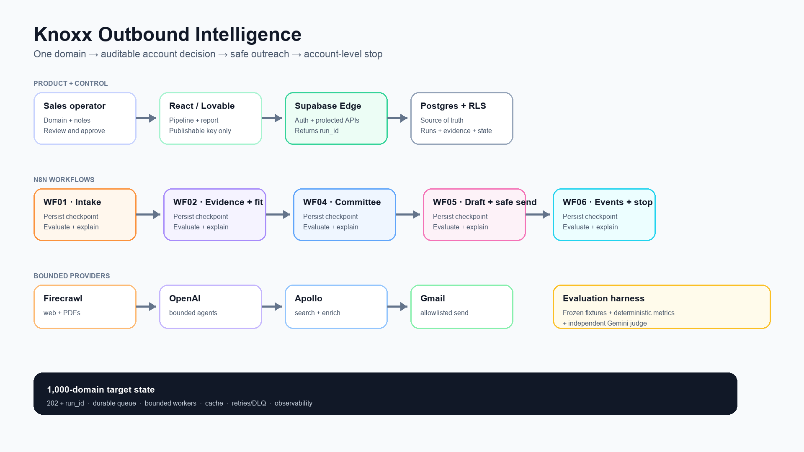

# Knoxx Outbound Intelligence

## AI-powered account research, ingredient qualification and safe outreach

Technical interview case study · portfolio build

**Presenter:** Rochak Singhal  
**Demo mode:** Real prospects blocked; Gmail is forced to an owned test inbox.

---

# The problem and the product decision

Sales research is fragmented across websites, PDFs, spreadsheets and contact tools. The real problem is not “write a cold email.” It is deciding whether an account deserves attention, showing the evidence, finding the right buying committee and stopping outreach when the organization engages.

**Product boundary**

- One workflow run investigates exactly one company.
- Multiple companies can run independently and asynchronously.
- Re-running a known domain creates a new immutable research run on the existing account.
- AI proposes evidence-backed judgments; code owns arithmetic, thresholds, identity, state and safety.
- Human approval is mandatory before sending.

**Interview minimum viable workflow**

`domain → evidence → ingredient opportunity → fit → contacts → draft → approval → engagement → stop rule`

---

# Success means better prioritization—not more automated email

**Primary user:** a salesperson or business-development manager deciding where to spend research and outreach time.

**Job to be done:** “Tell me whether this account is worth pursuing, show me why, identify the likely buying group, recommend a safe next action and stop when the organization engages.”

**North-star candidate:** sales-accepted qualified accounts per research hour.

| Pilot outcome | How it is measured |
|---|---|
| Faster research | Median analyst minutes from domain to reviewed brief |
| Better prioritization | Precision of `qualified` accounts accepted by sales |
| Trustworthy research | Citation coverage and unsupported-claim rate |
| Efficient economics | Cost per started, completed and sales-accepted account |
| Useful activation | Approved sequences, positive replies and meetings—never raw send volume alone |

**Non-negotiable guardrails:** zero unintended recipients, zero unsupported claims on golden cases, 100% suppression/stop-rule tests and human approval before activation. Targets should be baselined with sales during a controlled pilot, not invented in advance.

---

# Assumptions made vs. questions the business must answer

| Stage | Demo assumption | Question sales must answer before production |
|---|---|---|
| Account identity | Canonical domain is the account key; subsidiaries remain linked | Qualify subsidiaries separately or roll them into the parent? |
| ICP | Prepared-food manufacturers with recurring ingredient demand | What three traits make an account unquestionably valuable? |
| Catalogue | Six synthetic Knoxx products with aliases, MOQ and service metadata | Which SKUs, capacity, pricing, certifications and claims are approved? |
| Geography | Australia is potentially serviceable but requires review | Which postcodes/regions and delivery-time limits are hard constraints? |
| Demand | Meals × dish share × kg/meal, returned as a range | What uncertainty is acceptable and which volume/revenue floor matters? |
| Qualification | 40 product + 25 evidence + 20 scale + 15 supply − risk | Should volume, margin or strategic value dominate? What disqualifies? |
| Buying committee | Procurement, R&D/NPD, operations, commercial | Who is champion, technical approver, economic buyer and blocker? |
| Outreach | One pain, four touches on days 0/3/7/12 | Which proof, claims, CTA and maximum attempts are approved? |
| Stop rules | Click raises intent; reply/booking pauses the organization | Which events stop a person vs. the whole account? |

---

# Q1 — Architecture walkthrough

**Presentation source of truth:** `docs/architecture-clean.svg`  
**Optional editable source:** `docs/miro-architecture.md`

The deployed app never talks directly to Firecrawl, Apollo, Gmail or an LLM. It calls protected Supabase Edge Functions. Supabase stores the source of truth; n8n executes the long-running provider and agent steps.

---

# From a raw domain to completed database rows

1. **Accept quickly.** The frontend posts a website to `start-account-research`; the API returns `account_id`, `run_id` and status.
2. **Canonicalize deterministically.** WF01 validates HTTP(S), removes `www`/tracking parameters and reuses a matching account or alias.
3. **Preserve the run.** Postgres stores a new immutable `research_run`, even when the account already exists.
4. **Collect evidence.** WF02 submits an asynchronous Firecrawl job, polls it, bounds the pages and keeps URL/title/passage metadata.
5. **Interpret, then calculate.** The fit agent extracts dishes, scale, geography and pain hypotheses; a code node validates source keys, computes quantity ranges and applies the score rubric.
6. **Find people efficiently.** WF04 searches Apollo broadly, enriches only the top one or two candidates and ranks a 3–5 person committee.
7. **Draft safely.** WF05 writes a four-touch draft; the UI requires human approval; demo mode overrides the recipient.
8. **Close the loop.** WF06 records clicks/replies/bookings idempotently. A positive reply pauses every other contact at the organization.

**Rows touched:** `accounts`, `research_runs`, `research_sources`, `account_findings`, `ingredient_matches`, `quantity_forecasts`, `account_scores`, `contacts`, `contact_rankings`, `outreach_sequences`, `outreach_messages`, `engagement_events`, `audit_log`.

---

# Agent boundaries: where AI helps and where it must not decide

| AI is appropriate for | Deterministic code is appropriate for |
|---|---|
| Interpreting menu/catalogue language | Canonical domain and duplicate detection |
| Separating observed, inferred and hypothetical claims | Evidence source-key validation |
| Mapping ingredient synonyms to catalogue candidates | Quantity formulas and low/base/high arithmetic |
| Reasoning about role relevance from titles | Weighted fit/contact scores and thresholds |
| Selecting a persona-relevant pain/value proposition | Approval, scheduling, suppression and recipient override |
| Classifying bounded reply text | Idempotency and organization-wide stop rules |

**Why hybrid beats an all-agent design:** requirements can change through versioned database rules and prompts, but money, safety and state remain reproducible. A second “critic” agent may assess research sufficiency and recommend `proceed`, `review` or `re-research`; it still cannot override missing evidence or calculate the final score.

---

# Q2 — Prompt engineering: a reusable structure

1. **Role:** one bounded job, not a vague “sales expert.”
2. **Objective:** the business decision the output must support.
3. **Context:** account, catalogue, qualification policy and salesperson notes.
4. **Evidence boundary:** only supplied sources; every claim cites a known source key.
5. **Ordered procedure:** identity → products → scale → geography → pains → matches → risks.
6. **Tools:** define when catalogue/history lookup is mandatory.
7. **Guardrails:** what must never be invented or acted upon.
8. **Expected format:** strict JSON schema, enums, nullable fields and bounded arrays.
9. **Examples:** one supported conclusion and one `insufficient_evidence` case.
10. **Self-check:** citations valid, hypotheses labeled, unknowns remain null.

**Prompting principle:** constrain the model’s *decision surface*, not just its prose style.

---

# Product-fit prompt: why it is structured this way

> You are the Knoxx Account Intelligence & Fit Analyst. Convert bounded company evidence into an auditable opportunity brief. Use only supplied evidence and approved catalogue results. For every material claim return `evidence_strength`, `confidence`, and valid `source_keys`. Never invent a dish, quantity, pain, location, contact or source. Pain is a hypothesis unless explicitly stated. Return quantity inputs only when observed or tied to a visible assumption; otherwise return null and `insufficient_evidence`. The workflow—not you—calculates demand ranges, score and tier.

**Design choices**

- The model receives bounded evidence, reducing prompt injection, cost and irrelevant pages.
- `observed / inferred / hypothesis` prevents a plausible pain from becoming a fake fact.
- Catalogue lookup is required before a product match, so new catalogue items can be considered without rewriting code.
- Nullable inputs prevent fabricated precision when meal share or kg/meal is unknown.
- The agent explains risk; deterministic code applies the approved penalty and thresholds.
- A structured parser catches syntax; code validates semantic rules; frozen evaluations catch regressions.

---

# Model selection by stage

| Stage | Recommended model/provider | Why |
|---|---|---|
| Retrieval | Firecrawl, no LLM | Preserve URLs, passages, PDF content and timestamps before interpretation. |
| Account intelligence | `gpt-5.6-terra`, medium reasoning | Strong multi-source synthesis/tool use with a balanced quality-cost profile. |
| Buying committee | `gpt-5.6-terra`, medium reasoning | Handles title variants and organizational reasoning on a bounded candidate list. |
| Outreach drafting | `gpt-5.6-luna`, low reasoning | High-volume, constrained copy from already-approved facts and persona. |
| Reply classifier | `gpt-5.6-luna`, low reasoning | Narrow fixed taxonomy; low-confidence outputs go to manual review. |
| Independent evaluator | `gemini-3.6-flash` | Cross-provider judge lowers correlated error; deterministic metrics remain primary. |
| Escalation only | `gpt-5.6-sol`, high reasoning | Reserved for ambiguous, high-value review—not routine traffic. |

OpenAI positions Terra as its intelligence/cost balance, Luna for cost-sensitive workloads and Sol for complex professional work. Google positions Gemini 3.6 Flash as a stable speed/intelligence balance and documents strict JSON-schema output. Model promotion is evaluation-led, never based on marketing alone.

Sources: [OpenAI models](https://developers.openai.com/api/docs/models), [OpenAI model guidance](https://developers.openai.com/api/docs/guides/latest-model), [Gemini models](https://ai.google.dev/gemini-api/docs/models), [Gemini structured outputs](https://ai.google.dev/gemini-api/docs/structured-output).

---

# Evaluations: quality is a release gate, not a dashboard decoration

Each agent workflow has two entry paths:

- **Production:** provider calls + real persisted state.
- **Evaluation:** frozen evidence/candidate/reply fixtures, so tests are repeatable and do not spend Firecrawl/Apollo credits.

Each output passes three layers:

1. **Structured parser:** valid types and required fields.
2. **Deterministic metrics:** citation coverage, allowed IDs, four-touch compliance, tier/persona agreement and safety checks.
3. **Independent judge:** a different model evaluates semantic quality; it cannot bypass a failed hard rule.

Promotion gates include 99% schema validity, 95% citation coverage, zero unsupported claims on golden cases, 100% outreach compliance and 100% stop-rule tests.

---

# Q3 — The live data: what actually worked

**Live demo:** [knoxx-insight-quest.lovable.app](https://knoxx-insight-quest.lovable.app)  
**Golden account:** Snapfresh (synthetic catalogue, contacts and historical outcomes are visibly labeled).

| Persisted proof | Observed result |
|---|---|
| Account identity | `snapfresh.com.au`; repeat intake created another immutable run on one account |
| Buying committee | 3 synthetic demo candidates: scores 90, 82 and 74 |
| Outreach | 1 four-touch sequence; touches 1–2 sent to the safe inbox; touches 3–4 remained draft |
| Tracked CTA | `cta_click` recorded; account was not paused on click alone |
| Gmail reply | `positive_reply` recorded from Gmail |
| Account stop rule | Sequence moved to `paused`; primary contact `replied`; two other contacts `paused` |
| Security | All 22 public tables have RLS; service/provider credentials remain server-side |

**Connection status verified 10 August 2026:** the published site currently runs in fixture mode because its production `VITE_SUPABASE_PUBLISHABLE_KEY` is empty. The correct Supabase URL is bundled, but authentication/live Edge Function calls require a republish after configuring that browser key.

**Honest limitation:** the newest live research run is still `running`, and the older run is `failed_partial`; evidence and ingredient-match rows have not yet been persisted in the live project. The fixture UI demonstrates the intended report, but it must not be described as live Firecrawl proof.

---

# Accuracy and actionability assessment

**Actionable now**

- Canonical account identity and immutable run history.
- Explainable contact ordering from bounded candidates.
- Persona-specific four-touch drafts with approval and recipient safety.
- Tracked engagement and organization-wide stopping behaviour.

**Useful with a label**

- Scale, dishes and ingredient overlap when backed by a retained source passage.
- Pain points as `hypothesis`, not customer-confirmed facts.
- Quantity as a low/base/high planning range with visible inputs.

**Requires sales validation**

- Knoxx service region, capacity, MOQ, margin and approved claims.
- Exact recipe share and ingredient dosage.
- Whether a ranked title is the real economic buyer for that organization.

**Current technical gap**

- Replace the long synchronous crawl path with an async job/queue and persist every completed research checkpoint before downstream work.

---

# Q4 — What breaks at 1,000 domains tomorrow?

| Bottleneck | What happens | Immediate response |
|---|---|---|
| Crawl latency/concurrency | 429s and long webhooks | Submit async Firecrawl jobs, honor `Retry-After`, bound pages and cache by content hash |
| LLM tokens/quality | Cost grows; malformed or unsupported claims | Bounded evidence, prompt cache, economical default model, one repair retry, escalation only on uncertainty |
| Apollo credits/plan access | Enrichment becomes the largest marginal data cost | Search first, rank cheaply, enrich only top 1–2, read live endpoint quotas |
| n8n execution capacity | Long-lived waits occupy executions; bursts pile up | Queue mode, independent worker pools, per-provider concurrency budgets |
| Postgres contention | Duplicate runs/events and connection pressure | Unique/idempotency keys, short transactions, pooled connections, indexes and append-only events |
| Operational visibility | Stuck runs look like success | Stage checkpoints, queue-age alerts, provider tracing, DLQ and replay UI |

Firecrawl documents 429/concurrency backoff and recommends async crawl for timeouts. Apollo limits vary by endpoint and plan; enrichment may consume credits only when qualifying data is returned. Sources: [Firecrawl errors](https://docs.firecrawl.dev/api-reference/errors), [Firecrawl crawl](https://docs.firecrawl.dev/api-reference/endpoint/crawl-post), [Apollo rate limits](https://docs.apollo.io/reference/rate-limits), [Apollo credits](https://docs.apollo.io/docs/api-pricing).

---

# Enterprise-ready re-architecture

**Accept → queue → checkpoint → notify**

1. Intake writes account + run and returns `202 Accepted` with `run_id` in under a second.
2. Durable jobs split retrieval, extraction, scoring, contact discovery and drafting.
3. Worker pools have separate Firecrawl, LLM and Apollo concurrency/rate budgets.
4. Each stage uses `run_id:stage:input_version` as its idempotency key.
5. Transient failures retry with backoff/jitter; permanent failures become `failed_partial`; exhausted jobs enter a dead-letter review queue.
6. Retrieval is cached by content hash and freshness policy; rules/catalogue changes trigger targeted reprocessing.
7. The frontend polls/subscribes to persisted stages, so users can launch many accounts without holding web requests open.

**Illustrative capacity:** 1,000 jobs over eight hours is about 2.1 jobs/minute. At three minutes of worker time per full run, average concurrency is about 6.3; provision roughly 10–15 slots for variance, then cap providers separately. A burst is queued—it is never translated into 1,000 simultaneous provider calls.

---

# Cost story: measure cost per qualified account

Do not invent a dollar promise before a pilot.

`variable cost/account = crawl pages + LLM input/output + successful enrichment + email/event/storage`

**Controls that matter**

- Reuse fresh evidence; invalidate by content hash, catalogue version or rule version.
- Stop downstream spend on disqualified accounts.
- Bound page, token, enrichment and retry budgets per run.
- Keep arithmetic, suppression and state deterministic.
- Use Luna for bounded high-volume tasks, Terra where reasoning matters, Sol only for escalations.
- Measure cost per started, completed and qualified account against research time saved and pipeline created.

If 30% of 1,000 daily requests reuse fresh evidence, plan for 700 full runs and 300 lightweight revalidations—not 1,000 full crawls.

---

# CPO decision: approve a controlled pilot, not a production rollout

**Why I would fund the next step**

- The design solves a real prioritization problem and limits AI to decisions where ambiguity exists.
- A real click and Gmail reply exercised the downstream account-level stop controller.
- The schema, evaluation harness, safe recipient override and immutable runs create an auditable foundation.

**Why I would not call it production-ready yet**

- Live Firecrawl evidence/ingredient persistence is incomplete.
- Sales still needs to validate ICP, catalogue capacity, claims, service regions and qualification thresholds.
- The pilot still needs second-user RLS, load/chaos, monitoring, retention and compliance/lawful-basis checks.

**Recommended next decision:** run a 25-account assisted pilot. Compare AI briefs with sales review, measure research time, qualified-account precision, citation quality and cost per accepted account, then decide whether to automate more.

**Portfolio repository:** `rochaksinghal01/AI-PM-Portfolio`  
**Architecture source:** `docs/miro-architecture.md`  
**Interview guide:** `docs/workflow-interview-guide.md`
