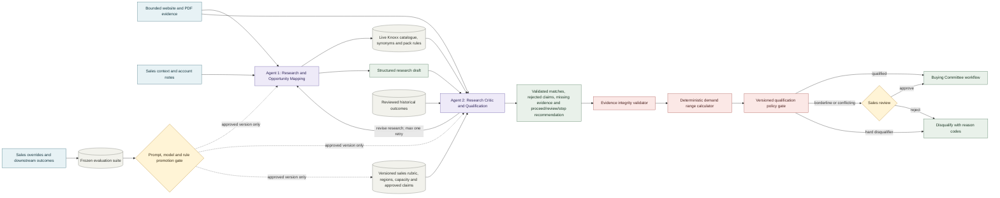
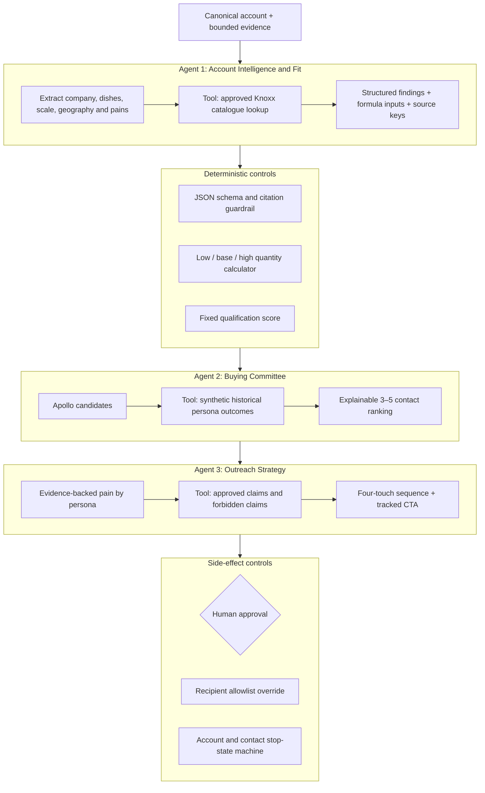
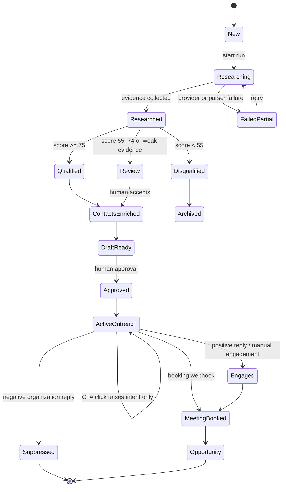
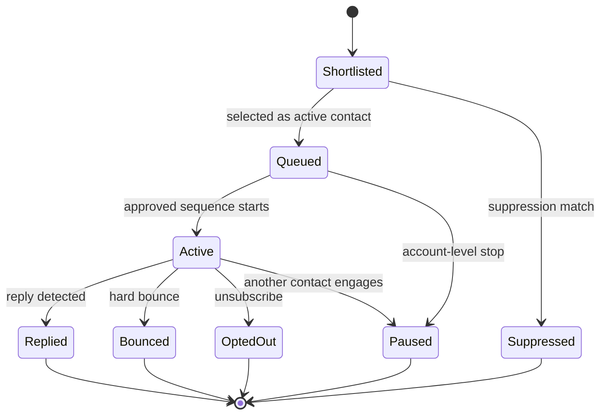
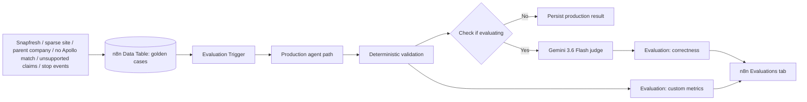

# Miro-ready architecture diagrams

Open a Miro board, select **Tools, Media and Integrations → Mermaid Diagrams**, paste one block at a time, and choose **Add to board**. Keep this file as the version-controlled source of truth.

## 1. End-to-end system architecture

```mermaid
flowchart LR
  classDef human fill:#FFF4D6,stroke:#B98422,color:#392D17
  classDef app fill:#E9F1EA,stroke:#4B7659,color:#1C3825
  classDef orchestration fill:#EEEAF8,stroke:#6657A4,color:#30275A
  classDef provider fill:#E7F2F5,stroke:#3F7381,color:#173841
  classDef data fill:#F2F2EC,stroke:#767A71,color:#2D302A
  classDef safety fill:#FBE8E6,stroke:#A9534D,color:#4B211E

  User[Sales operator]:::human --> UI[Lovable React app]:::app
  UI --> Auth[Supabase Auth]:::app
  UI --> Edge[Protected Edge Functions]:::app
  Edge --> DB[(Supabase Postgres + RLS)]:::data
  Edge --> Orchestrator[WF01 Account intake]:::orchestration

  Orchestrator --> Evidence[WF02 Evidence + Fit Agent]:::orchestration
  Evidence --> Firecrawl[Firecrawl web and PDF extraction]:::provider
  Evidence --> AccountAgent[GPT-5.6 Terra Account Agent]:::provider
  AccountAgent --> Catalog[Knoxx catalogue lookup tool]:::data
  Evidence --> Rules[Deterministic scoring and quantity ranges]:::safety

  Rules --> Committee[WF04 Buying Committee Agent]:::orchestration
  Committee --> Apollo[Apollo search then enrichment]:::provider
  Committee --> ContactAgent[GPT-5.6 Terra Ranking Agent]:::provider

  ContactAgent --> Outreach[WF05 Outreach Strategy Agent]:::orchestration
  Outreach --> CopyModel[GPT-5.6 Luna copy generation]:::provider
  Outreach --> Approval{Human approval gate}:::human
  Approval -->|Approved| SafeSend[Allowlisted Gmail adapter]:::safety
  Approval -->|Rejected| Drafts[Return to drafts]:::data

  SafeSend --> Events[WF06 Engagement controller]:::orchestration
  CTA[Tracked CTA]:::provider --> Events
  Replies[Gmail replies / booking webhook]:::provider --> Events
  Events --> StopRules[Deterministic account stop rules]:::safety
  StopRules --> DB
  DB --> UI

  Evidence -. evaluation dataset .-> Eval[Native n8n Evaluations]:::orchestration
  Committee -. evaluation dataset .-> Eval
  Outreach -. evaluation dataset .-> Eval
  Eval --> Judge[Gemini 3.6 Flash independent judge]:::provider
  Eval --> Metrics[(Schema, evidence, ranking, safety metrics)]:::data
```

## 2. Target-state research and qualification architecture

> Portfolio target state, not the current demo workflow. The demo keeps one research agent plus deterministic scoring; the intended product adds an independent production critic before the policy gate.

### Target-state decision ownership

| Decision | Owner |
|---|---|
| Interpret company pages, menus and catalogues | Agent 1 |
| Extract dishes and propose ingredient opportunities | Agent 1 |
| Challenge citations, assumptions and commercial plausibility | Agent 2 |
| Recommend `proceed`, `sales_review`, `stop` or `revise_research` | Agent 2 |
| Verify source keys and required fields | Deterministic integrity validator |
| Calculate low/base/high demand | Deterministic forecast calculator |
| Enforce geography, capacity, suppression and score thresholds | Versioned deterministic policy gate |
| Resolve borderline or conflicting evidence | Sales reviewer |

The system becomes smarter through reviewed outcomes, expanded golden cases and controlled prompt/model/rule promotion. It does not silently retrain or rewrite qualification policy from live outcomes.

## 3. Demo agent boundaries and ownership

> This is the currently implemented interview demo.

## 4. Account and contact state machines

## 5. Evaluation architecture

