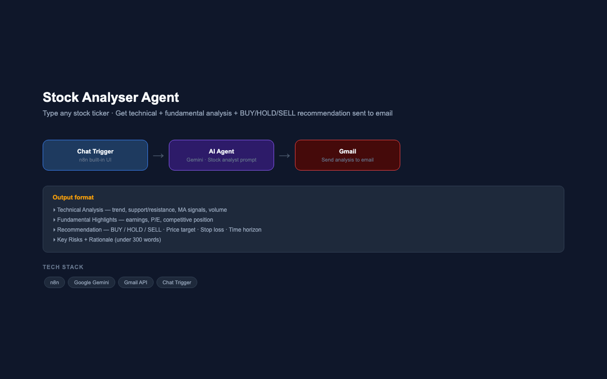

# Stock Analyser Agent — AI-Powered Stock Research to Email

**Type a Ticker · Get Technical + Fundamental Analysis + BUY/HOLD/SELL Recommendation · Built on n8n + Google Gemini + Gmail**

---



---

## Overview

A conversational stock analysis agent that takes any stock ticker symbol as input and delivers a structured BUY/HOLD/SELL recommendation — covering technical analysis, fundamental highlights, price targets, stop loss levels, and key risks — directly to your email. Built on n8n's built-in chat interface with Google Gemini as the reasoning engine and Gmail for delivery.

---

## Problem Statement

Retail investors spend too much time piecing together fragmented research from multiple sources before making a decision. There was a gap for a fast, opinionated analysis tool that consolidates technical and fundamental signals into a concise, actionable output under 300 words — delivered directly to email without switching tabs.

---

## Workflow Architecture

```
Investor (n8n Chat UI)
        │  Types: "AAPL" or "RELIANCE.NS"
        ▼
┌──────────────────────────┐
│   Chat Trigger           │  ← n8n built-in public chat interface
│   (public=true)          │
└────────┬─────────────────┘
         │
         ▼
┌────────────────────────────────────────────────────┐
│                    AI Agent                         │
│  Model: Google Gemini (PaLM)                        │
│  Prompt: Professional stock analyst                 │
│  Output: Structured analysis in defined format      │
└────────┬───────────────────────────────────────────┘
         │
         ▼
┌──────────────────────────┐
│        Gmail             │  ← Send analysis email to rochak.singhal@gmail.com
│  Subject: Stock Analysis │     Subject: "Stock Analysis of [TICKER]"
│  of [TICKER]             │
└──────────────────────────┘
```

---

## Analysis Output Format

Each analysis includes the following sections:

| Section | Content |
|---|---|
| **Technical Analysis** | Price trend · Support & resistance · Moving average signals · Volume |
| **Fundamental Highlights** | Earnings/revenue trends · P/E ratio · Debt · Industry position · Recent news |
| **Recommendation** | BUY / HOLD / SELL · Confidence level · Price target · Stop loss · Time horizon |
| **Key Risks** | 2–3 main risks to monitor |
| **Rationale** | 2–3 sentence justification |

All output kept under 300 words — optimised for actionable clarity, not noise.

---

## System Prompt Design

| Design Decision | Implementation |
|---|---|
| **Role clarity** | Agent identifies as "professional stock market analyst" |
| **Structured output** | Fixed format with bold headers for each section |
| **Actionability** | Every analysis ends with a clear BUY/HOLD/SELL call and confidence level |
| **Brevity** | Hard cap at 300 words — forces concise, signal-rich output |
| **Audience** | Framed for retail investors — avoids jargon, includes time horizon |

---

## Tech Stack

| Component | Technology |
|---|---|
| Workflow Orchestration | n8n |
| LLM | Google Gemini (PaLM API) |
| Agent Framework | n8n LangChain Agent |
| Trigger | n8n Chat Trigger (public UI) |
| Delivery | Gmail API (OAuth2) |
