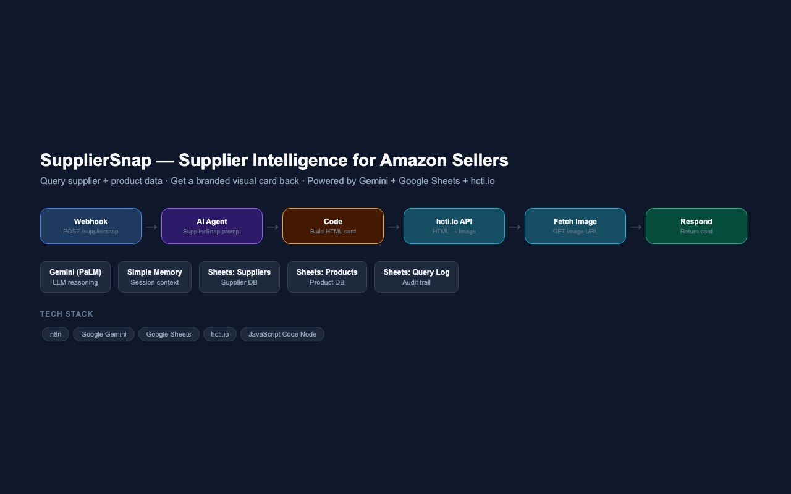

# SupplierSnap — AI Supplier Intelligence for Amazon Sellers

**Supplier Research Automation · Built on n8n + Google Gemini + Google Sheets + hcti.io**

---



---

## Overview

SupplierSnap is an AI-powered supplier intelligence tool for Amazon sellers. Send a product name, ASIN, SKU, or supplier name via webhook, and the system queries a structured supplier and product database, reasons over the data with Gemini, and returns a branded visual card — complete with pricing, MOQ, lead time, supplier metrics, certifications, and risk flags — as a rendered image.

---

## Problem Statement

Amazon sellers spend hours manually cross-referencing supplier data across spreadsheets and portals before placing orders. There was no fast, automated way to get a consolidated supplier intelligence view with risk signals in a shareable, visual format. SupplierSnap collapses that research into a single webhook call.

---

## Workflow Architecture

```
Seller (any client)
        │
        ▼
┌──────────────────┐
│     Webhook      │  ← POST /suppliersnap with product query
└────────┬─────────┘
         │
         ▼
┌────────────────────────────────────────────────────┐
│                    AI Agent                         │
│  Model: Google Gemini (PaLM)                        │
│  Memory: Buffer Window (session context)            │
│  Tools: Products Sheet · Suppliers Sheet · Log      │
│  Output: Strict JSON with 15 supplier fields        │
└────────┬───────────────────────────────────────────┘
         │
         ▼
┌──────────────────────────┐
│   Code (JavaScript)       │  ← Build branded HTML card from JSON
│   Risk colour coding      │
│   Verified badge logic    │
└────────┬─────────────────┘
         │
         ▼
┌──────────────────────────┐
│  HTTP Request (hcti.io)  │  ← POST HTML → returns image URL
└────────┬─────────────────┘
         │
         ▼
┌──────────────────────────┐
│  HTTP Request (fetch)    │  ← GET rendered image binary
└────────┬─────────────────┘
         │
         ▼
┌──────────────────────────┐
│   Respond to Webhook     │  ← Return image to caller
└──────────────────────────┘
```

---

## Nodes Explained

### 1. Webhook
Accepts POST requests at `/suppliersnap`. Passes the raw query to the AI Agent.

### 2. AI Agent
Powered by Google Gemini. Uses two Google Sheets tools to look up product and supplier data, then returns a strict 15-field JSON object covering commercials, supplier profile, and risk flags. Falls back to `"Not found"` values if no match exists.

### 3. Google Sheets Tools
- **Products sheet** — product name, ASIN, SKU, category, unit price, MOQ, lead time
- **Suppliers sheet** — supplier name, country, years active, response rate, on-time delivery, verified badge, certifications, risk flags
- **Query Log sheet** — audit trail of all queries

### 4. Code (JavaScript)
Parses the agent's JSON output, applies risk colour logic (red/green), and assembles a polished HTML card with sections for commercials, supplier profile, certifications, and risk signals.

### 5. hcti.io API
Converts the HTML card into a rendered PNG image via the HTML/CSS to Image API.

### 6. Fetch Image
GETs the rendered image binary from the returned URL.

### 7. Respond to Webhook
Returns the visual supplier card to the caller.

---

## Output Card Sections

| Section | Fields |
|---|---|
| Header | Product name · ASIN · SKU · Category · Verified badge |
| Commercials | Unit price · MOQ · Lead time |
| Supplier | Name · Country · Years active · Response rate · On-time delivery |
| Certifications | ISO, CE, RoHS, etc. as tags |
| Risk Signals | Green (all clear) or Red (risk detected) with details |

---

## Tech Stack

| Component | Technology |
|---|---|
| Workflow Orchestration | n8n |
| LLM | Google Gemini (PaLM API) |
| Agent Framework | n8n LangChain Agent |
| Memory | Buffer Window (session) |
| Knowledge Base | Google Sheets (Products + Suppliers + Query Log) |
| Card Rendering | JavaScript Code Node + hcti.io HTML/CSS to Image API |
| Trigger | Webhook (POST) |
