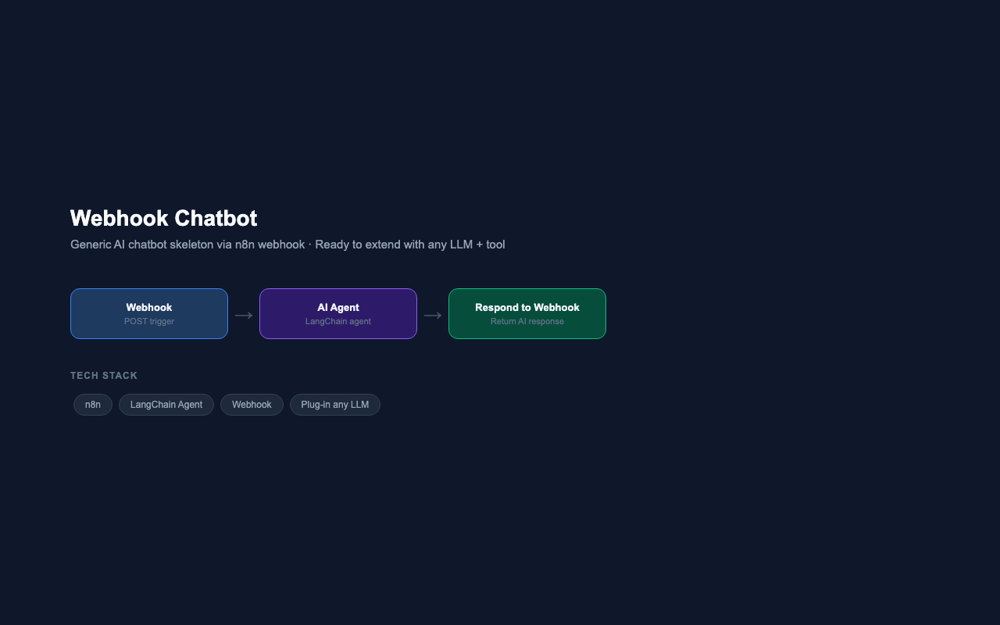

# Webhook Chatbot — Generic AI Chatbot Skeleton

**Extensible AI Chatbot Template via n8n Webhook · Built on n8n + LangChain**

---



---

## Overview

A minimal but production-ready AI chatbot skeleton built on n8n's LangChain agent node. The workflow accepts any POST request via webhook, passes the input to an AI agent for reasoning, and returns the response — making it the base layer for any chatbot use case. Plug in any LLM, add tools, and extend the system prompt to fit your domain.

---

## Problem Statement

Every AI chatbot project starts with the same boilerplate: a trigger, an agent, and a response node. Rather than rebuilding this from scratch each time, this skeleton provides a clean, tested starting point that can be extended with LLMs, memory, tools, and custom system prompts in minutes.

---

## Workflow Architecture

```
POST Request (any client)
        │
        ▼
┌──────────────────┐
│     Webhook      │  ← Accepts POST at /webhook/{path}
└────────┬─────────┘
         │
         ▼
┌──────────────────┐
│    AI Agent      │  ← LangChain agent — add your LLM + system prompt
└────────┬─────────┘
         │
         ▼
┌──────────────────────┐
│  Respond to Webhook  │  ← Returns AI output to caller
└──────────────────────┘
```

---

## How to Extend

| Extension | How |
|---|---|
| Add an LLM | Connect Google Gemini, OpenAI, or Claude to the AI Agent |
| Add a system prompt | Set prompt type to "Define" and write your domain instructions |
| Add memory | Connect a Buffer Window Memory node to maintain conversation context |
| Add tools | Connect Google Sheets, HTTP Request, or database nodes as agent tools |
| Add a frontend | Call this webhook from any web app, Telegram bot, or Slack integration |

---

## Tech Stack

| Component | Technology |
|---|---|
| Workflow Orchestration | n8n |
| Agent Framework | n8n LangChain Agent |
| Trigger | Webhook (POST) |
| LLM | Plug-in any (Gemini, OpenAI, Claude) |
| Response | Respond to Webhook node |
