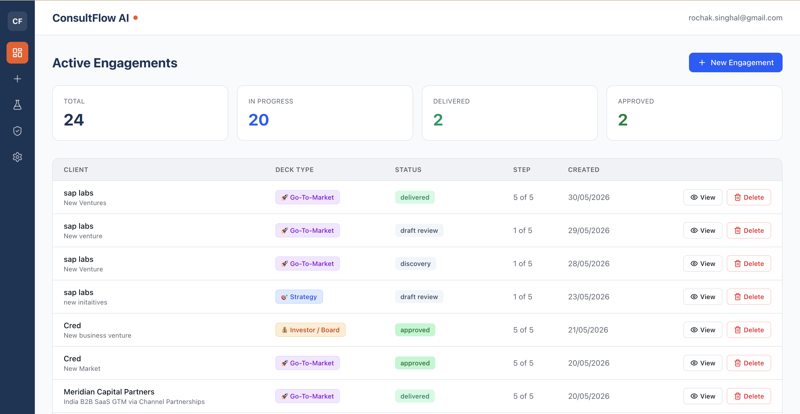
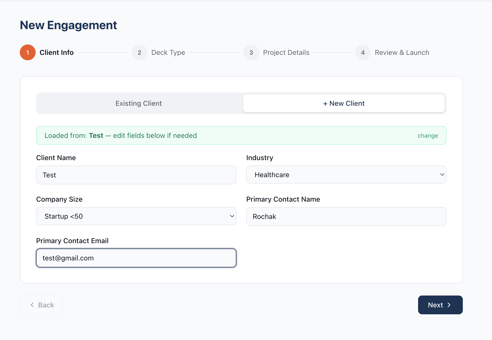
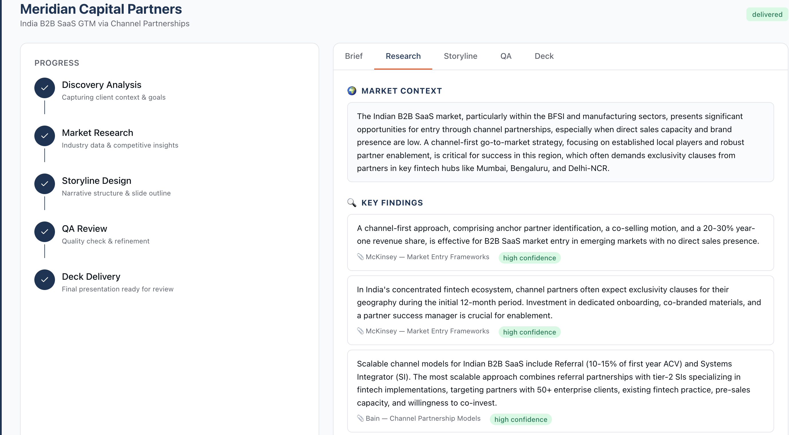
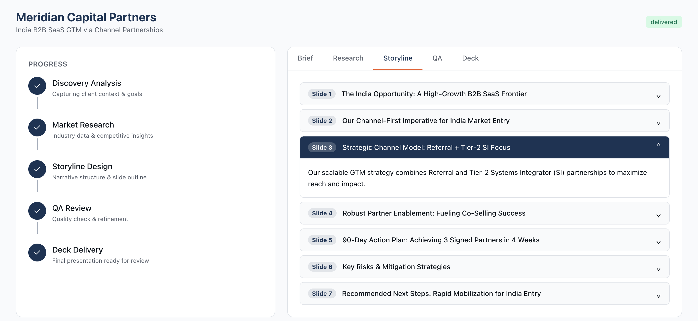
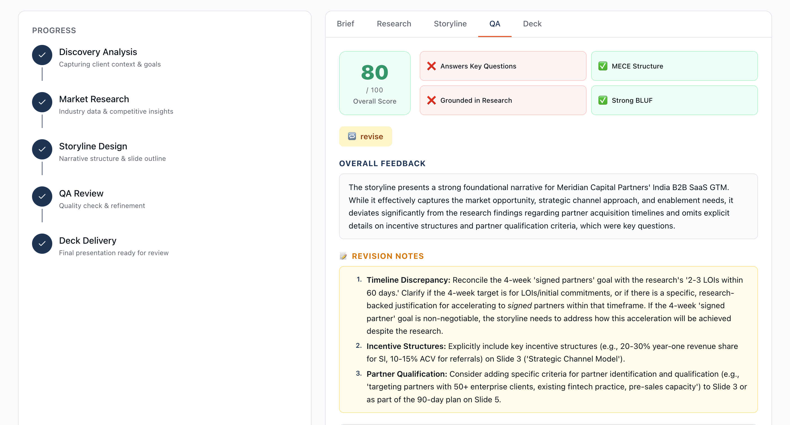
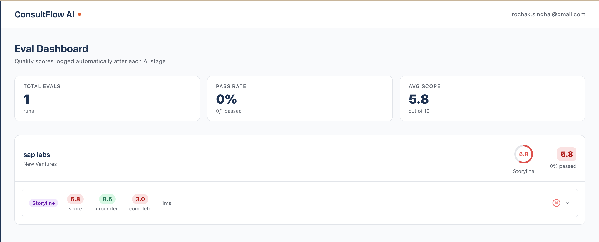
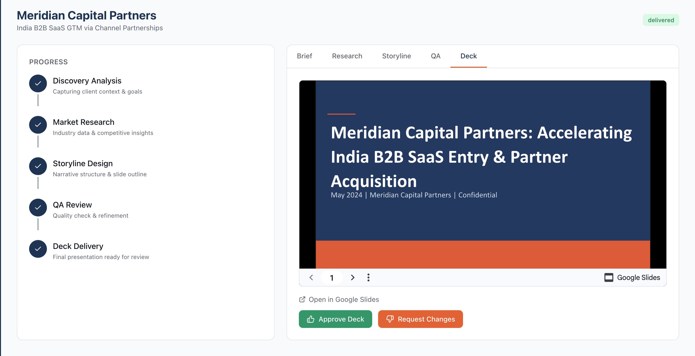

# ConsultFlow AI — Agentic Consulting Deck Automation with Institutional RAG

> An end-to-end AI system that automates consulting deck creation by combining a 5-gate agentic pipeline with a RAG layer trained on institutional knowledge — so every junior analyst produces output informed by your firm's most senior consultants.

**🔗 Live Demo:** [tanstack-start-app.rochak-singhal.workers.dev](https://tanstack-start-app.rochak-singhal.workers.dev)

---

## The Core Idea

Consulting firms lose institutional knowledge every time a senior person leaves. Junior analysts reinvent the wheel on every engagement. Partners spend hours reviewing and correcting basic structural mistakes.

ConsultFlow AI solves this by:

1. **Ingesting your firm's institutional knowledge** — past decks, frameworks, case studies, senior consultant notes — into a RAG (Retrieval-Augmented Generation) pipeline
2. **Letting users connect their Google Drive** to add their own documents, client context, or domain expertise
3. **Injecting that knowledge into every AI stage** — so research findings, storyline structure, and QA criteria are all grounded in what your best consultants would actually do
4. **Automating the full delivery pipeline** — from discovery brief to formatted Google Slides deck, with human approval at every gate

The result: a junior analyst with 1 year of experience produces output grounded in 10+ years of institutional knowledge.

---

## Screenshots

### Dashboard — Active Engagements


### New Engagement — 4-Step Wizard


### Gate 2 — AI Research Output (RAG-grounded findings with source citations)


### Gate 4 — Storyline with SCR Narrative Structure


### Gate 3 — QA Self-Audit (Score + Structured Feedback)


### Eval Dashboard — Automated Quality Scores per Stage


### Gate 5 — Delivered Google Slides Deck


---

## How the RAG Layer Works

```
Institutional Knowledge Sources
        │
        ├── Past consulting decks (PDF, PPTX)
        ├── Senior consultant frameworks & playbooks
        ├── Client-specific documents
        └── User's Google Drive (connected per engagement)
        │
        ▼
   [WF00 — RAG Pipeline]
   Chunks → Embeds → Stores in vector index
        │
        ▼
   Retrieved at each AI stage:
   ├── WF02 Research  → grounds findings in real frameworks
   ├── WF03 Storyline → mirrors how senior consultants structure narratives
   └── WF04 QA        → checks against institutional quality standards
```

**Google Drive integration** — users connect their Drive per engagement to give the AI access to client-specific context: previous meeting notes, competitor analysis, internal data. The AI isn't working from generic internet knowledge — it's working from *your* knowledge.

---

## The 5-Gate Pipeline

```
[Gate 1] Discovery & Requirements
        ↓  Client name, deck type, engagement goal, Google Drive link
[Gate 2] AI Research Agent  ← RAG-grounded
        ↓  Market context, key findings with citations, strategic recommendations, risks
        ↓  Analyst: Approve or Request Revision
[Gate 3] QA Review  ← RAG-grounded
        ↓  AI self-audits research against institutional quality standards
        ↓  Score (0-100), pass/fail checks, structured revision notes
        ↓  Analyst: Approve or Request Revision
[Gate 4] Storyline Generation  ← RAG-grounded
        ↓  SCR (Situation-Complication-Resolution) narrative, slide-by-slide structure
        ↓  Analyst: Approve or Request Revision
[Gate 5] Google Slides Delivery
        ↓  Approved storyline → formatted deck via Google Slides API → Google Drive
```

---

## Eval System — Measuring AI Quality at Every Stage

Every AI output is scored automatically in parallel after each gate.

| Metric | What it measures |
|---|---|
| **Score (0–10)** | Overall output quality |
| **Completeness** | All required sections covered |
| **Groundedness** | Claims backed by RAG sources and business context |
| **Latency (ms)** | AI generation time per stage |
| **Pass/Fail** | Score ≥ 7 = pass. Below threshold = flagged |

The `/evals` dashboard shows per-engagement score rings, pass rates, and expandable judge reasoning for every gate.

---

## Tech Stack

| Layer | Technology |
|---|---|
| Frontend | TanStack Start (SSR) on Cloudflare Workers |
| Database & Auth | Supabase (PostgreSQL + Row Level Security) |
| AI Model | Google Gemini 2.5 Flash |
| Automation & RAG | n8n (self-hosted on Railway) |
| Knowledge Sources | Google Drive API + uploaded documents |
| Deck Output | Google Slides API + QuickChart.io |
| Eval Storage | Supabase `eval_logs` table |

---

## System Architecture

```
User (Frontend — Cloudflare Workers)
        │
        ├─ POST /webhook/discovery ──→ n8n WF01
        ├─ GET  /engagements       ←── Supabase polling
        └─ POST approve/decline   ──→ n8n WF02–05

RAG Layer (runs on all AI stages):
WF00 → Chunks institutional docs → Embeds → Vector index
WF02/03/04 → Retrieves relevant context → Injects into Gemini prompt

Workflow chain:
WF01 Discovery  → stores requirements_json
WF02 Research   → RAG + Gemini → research_brief → triggers WF03
WF03 Storyline  → RAG + Gemini → storyline_json
WF04 QA         → RAG + Gemini → quality_report
WF05 Delivery   → Google Slides API → deck → Google Drive link

Parallel eval branch (WF02, WF03, WF04):
Each stage → [Update Supabase] + [Eval Score → Insert eval_logs]
```

---

## n8n Workflows

| File | Purpose |
|---|---|
| `wf00-rag.json` | **RAG pipeline** — ingests docs, embeds, builds vector index |
| `wf01-discovery.json` | Intake form → requirements stored in Supabase |
| `wf02-research.json` | RAG-grounded research agent + eval scoring |
| `wf03-storyline.json` | RAG-grounded storyline generator + eval scoring |
| `wf04-qa.json` | RAG-grounded QA self-audit + eval scoring |
| `wf05-google-slide.json` | Google Slides deck creation and Drive delivery |

---

## Post-Demo Roadmap

- [ ] Google OAuth — per-user Drive so decks land in each user's own folder automatically
- [ ] LLM-as-judge evals — Gemini grading Gemini with structured rubrics
- [ ] Supabase Edge Functions — replace n8n with serverless functions
- [ ] Multi-tenant RLS — each user sees only their own engagements
- [ ] Hallucination detection on RAG citations

---

## Presentation Deck

📄 [Download full project presentation](ConsultFlow-AI-Deck.pdf)

---

## Built By

**Rochak Singhal** — AI Product Manager
[LinkedIn](https://linkedin.com/in/rochak-singhal) · [Portfolio](https://github.com/rochaksinghal01/AI-PM-Portfolio)
