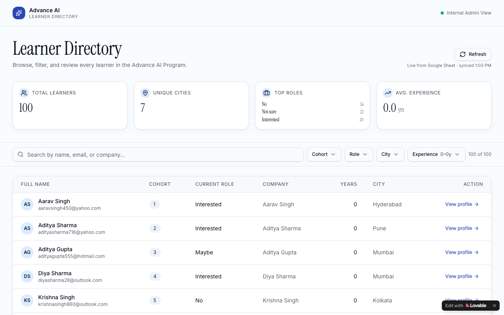

# Advance Learner Hub — AI Program Participant Directory

**Learner Management Dashboard for the Advance AI Program · Built with Lovable**

🔗 [Live App](https://advance-learner-hub.lovable.app)

---



---

## Overview

A learner directory and management dashboard for the Advance AI Program that displays participant profiles with live data synced from Google Sheets. Program administrators and team leads can browse, filter, and drill into learner profiles across cohorts, roles, cities, and experience levels — all from a single interface.

---

## Problem Statement

Managing learner information across cohorts in spreadsheets creates friction — no quick search, no visual stats, and no easy way to filter by role or location. Admins needed a clean, always-current directory that made participant data browsable without requiring engineering support to maintain.

---

## User Flow

```
Admin opens dashboard
        │
        ▼
Statistics overview loads
  └── Total learners · Top roles · Avg experience
        │
        ▼
Browse learner directory table
        │
        ▼
Apply filters
  ├── Cohort
  ├── Role
  ├── City
  └── Experience level
        │
        ▼
Click learner → Profile detail page
        │
        ▼
Data stays live via Google Sheets sync
```

---

## Tech Stack

| Component | Technology |
|---|---|
| Frontend Framework | React 19 + TypeScript |
| Build Tool | Vite |
| Routing | TanStack Router v1 |
| Data Fetching | TanStack React Query v5 |
| UI Components | Radix UI + shadcn/ui |
| Styling | Tailwind CSS v4 |
| Data Source | Google Sheets (via CSV + PapaParse) |
| Icons | Lucide React |
| Platform | Lovable |
