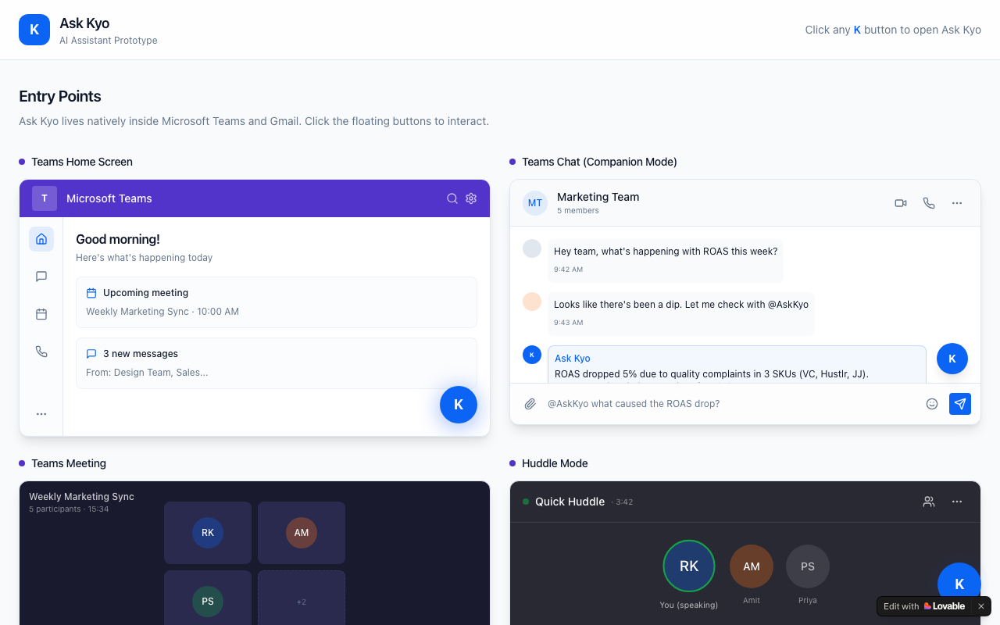

# Ask Kyo — AI Copilot for Customer Insight

**Embedded CX Intelligence for Microsoft Teams & Gmail · Built with Lovable**

🔗 [Live App](https://ask-kyo-insight.lovable.app)

---



---

## Overview

Ask Kyo is an AI copilot that lives natively inside Microsoft Teams and Gmail, giving support, product, analytics, and marketing teams instant access to customer feedback intelligence without switching context. Teams can ask natural-language questions, get structured insight cards, and surface anomalies — all from within the tools they already use every day.

---

## Problem Statement

Teams at Sentisum needed to query customer feedback and sentiment data without leaving their primary work tools. Switching to a separate analytics platform mid-workflow broke focus and slowed down decisions. The ask was to embed insight retrieval directly into Teams and Gmail so that answers were one question away, not one tab away.

---

## User Flow

```
User is in Teams or Gmail
        │
        ▼
Kyo appears as a floating assistant
        │
        ▼
User triggers Kyo
  ├── Teams: via chat companion, meeting mode, or huddle
  └── Gmail: via sidebar panel
        │
        ▼
Popup with team-specific question prompts
  ├── Support: "What are the top complaints this week?"
  ├── Product: "What features are users requesting?"
  ├── Analytics: "Any anomalies in sentiment today?"
  └── Marketing: "How is Campaign X landing with customers?"
        │
        ▼
Kyo returns structured insight card
  └── Summary · Evidence · Suggested next action
        │
        ▼
User acts without leaving their workflow
```

---

## Tech Stack

| Component | Technology |
|---|---|
| Frontend Framework | React 18 + TypeScript |
| Build Tool | Vite |
| UI Components | Radix UI + shadcn/ui |
| Styling | Tailwind CSS |
| Form Handling | React Hook Form + Zod |
| Data Fetching | TanStack React Query |
| Notifications | Sonner |
| Icons | Lucide React |
| Platform | Lovable |
