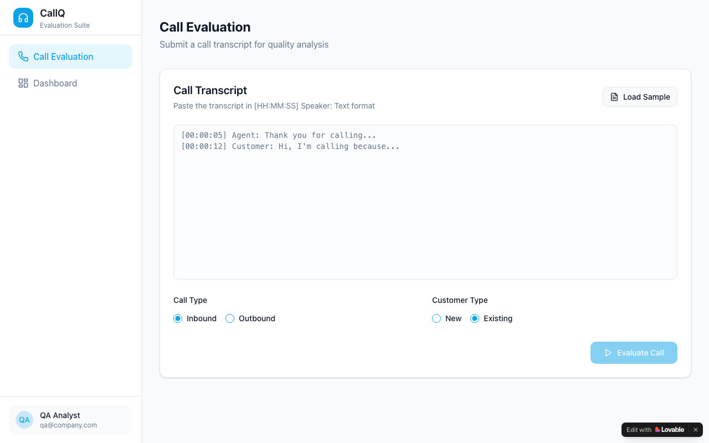

# Call Insight Craft — AI Call Quality Evaluation Dashboard

**Contact Centre QA Intelligence Platform · Built with Lovable**

🔗 [Live App](https://call-insight-craft.lovable.app)

---



---

## Overview

An AI-powered call quality evaluation dashboard for contact centres. QA managers and team leads can submit calls for evaluation, receive dimension-based quality scores, and surface performance patterns across their teams — replacing slow, manual call auditing with structured, automated insight.

---

## Problem Statement

Contact centre QA teams spend hours manually listening to and scoring calls with no consistency across reviewers. Managers lack a single view of call quality trends, team-level patterns, and routing signals. A lightweight evaluation tool with clear scoring dimensions and analytics was missing from most mid-market QA stacks.

---

## User Flow

```
Manager opens dashboard
        │
        ▼
Submit call for evaluation
  └── Upload or link call recording
        │
        ▼
AI evaluates across quality dimensions
  ├── Communication clarity
  ├── Issue resolution
  ├── Empathy & tone
  ├── Process adherence
  └── Customer satisfaction signal
        │
        ▼
Dimension scores generated
        │
        ▼
Dashboard view
  ├── Call metrics overview
  ├── Team performance trends
  └── Routing recommendations
        │
        ▼
Drill into individual call analytics
```

---

## Tech Stack

| Component | Technology |
|---|---|
| Frontend Framework | React 18 + TypeScript |
| Build Tool | Vite |
| UI Components | Radix UI + shadcn/ui |
| Styling | Tailwind CSS |
| Backend & Auth | Supabase |
| Data Fetching | TanStack React Query |
| Animations | Framer Motion |
| Charts | Recharts |
| Icons | Lucide React |
| Platform | Lovable |
