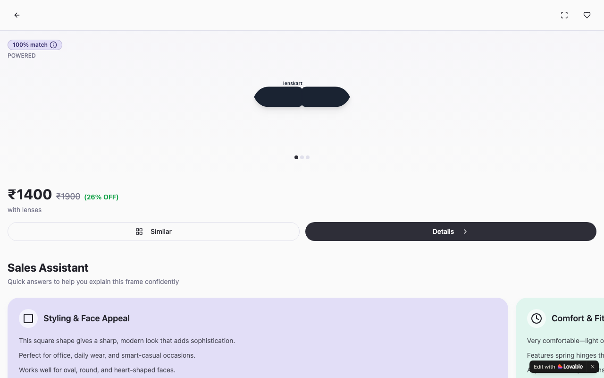

# Lenskart Frame Guide — In-Store Sales Assistant

**Retail AI Companion for Lenskart Store Associates · Built with Lovable**

🔗 [Live App](https://lenskart-frame-guide.lovable.app)

---



---

## Overview

A mobile-first sales assistant designed for Lenskart retail staff to confidently pitch eyewear frames to customers on the shop floor. Associates get instant access to swipeable product cards covering five dimensions — styling, comfort, features, collection identity, and active offers — plus an integrated chatbot to handle any customer question in real time, without leaving the app.

---

## Problem Statement

In-store associates at Lenskart often struggle to articulate the full value of premium frames under time pressure, leading to missed upsell opportunities and inconsistent customer experiences. There was no lightweight, phone-friendly tool that consolidated product knowledge, talking points, and live Q&A in one place.

---

## User Flow

```
Associate opens app
        │
        ▼
Product showcase loads
        │
        ▼
Swipe through 5 card dimensions
  ├── Styling & face shape compatibility
  ├── Comfort & fit details
  ├── Features & lens specs
  ├── Collection identity & brand story
  └── Active offers & pricing
        │
        ▼
Customer asks a question
        │
        ├── Common questions rail (pre-loaded FAQs)
        └── ChatBot popup (custom real-time Q&A)
        │
        ▼
Associate answers confidently → closes the sale
```

---

## Tech Stack

| Component | Technology |
|---|---|
| Frontend Framework | React 18 + TypeScript |
| Build Tool | Vite |
| UI Components | Radix UI + shadcn/ui |
| Styling | Tailwind CSS |
| Form Handling | React Hook Form + Zod |
| Data Fetching | TanStack React Query |
| Notifications | Sonner |
| Icons | Lucide React |
| Platform | Lovable |
