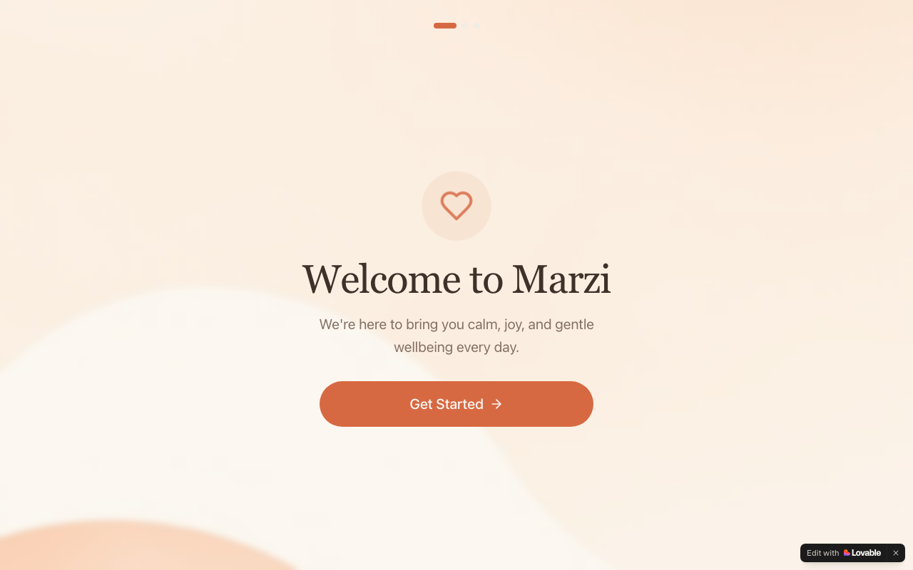

# Marzi — Your Gentle Wellness Companion

**AI-Powered Daily Calm & Mindfulness App · Built with Lovable**

🔗 [Live App](https://marzi-gentle-companion.lovable.app)

---



---

## Overview

Marzi is a wellness companion app that delivers personalised calm moments and mindfulness activities throughout the day. The app greets users based on the time of day, adapts content to their mood and stated interests, and offers curated meditations, breathing exercises, and gentle check-ins — making wellbeing feel effortless rather than effortful.

---

## Problem Statement

Most wellness apps feel like another item on the to-do list — structured, scheduled, and guilt-inducing when skipped. There was a gap for a low-friction companion that meets users where they are emotionally, without demanding commitment or consistency from day one.

---

## User Flow

```
User opens app
        │
        ▼
Time-aware greeting
  └── Good morning / afternoon / evening, personalised
        │
        ▼
Onboarding (first visit)
  └── Select wellness interests & preferences
        │
        ▼
Two-tab home experience
  ├── Moments tab
  │     └── Meditations, breathing, calm content
  └── Wellness tab
        └── Activities, movement, habit suggestions
        │
        ▼
Mood / feeling selector
  └── Adapts content recommendations to current state
        │
        ▼
Complete activity → mark done → streak tracking
```

---

## Tech Stack

| Component | Technology |
|---|---|
| Frontend Framework | React 18 + TypeScript |
| Build Tool | Vite |
| UI Components | Radix UI + shadcn/ui |
| Styling | Tailwind CSS |
| Form Handling | React Hook Form + Zod |
| Data Fetching | TanStack React Query |
| Notifications | Sonner |
| Icons | Lucide React |
| Platform | Lovable |
