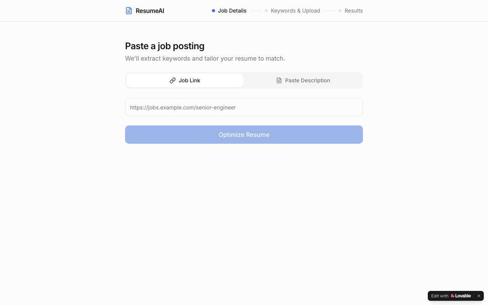

# Resume AI Builder Pro — ATS-Optimised Resume Generator

**AI-Powered Resume Keyword Matching for Job Seekers · Built with Lovable**

🔗 [Live App](https://resume-aibuilder-pro.lovable.app)

---



---

## Overview

An AI-powered resume builder that helps job seekers optimise their resumes against specific job descriptions. Users paste a job description, receive AI-generated keyword recommendations tailored to that role, and get a formatted, ATS-ready resume output — in minutes, not hours.

---

## Problem Statement

Most job seekers submit generic resumes that fail Applicant Tracking System (ATS) filters before a human ever reads them. Manually tailoring a resume for each application is time-consuming and inconsistent. There was no fast, guided tool that combined keyword intelligence with formatted resume output in a single flow.

---

## User Flow

```
User lands on app
        │
        ▼
Step 1: Job Input
  └── Paste job title + job description
        │
        ▼
Step 2: AI Processing
  └── Loading state while AI analyses the JD
        │
        ▼
Step 3: Keyword Recommendations
  └── AI surfaces high-impact keywords to include
        │
        ▼
Step 4: Resume Output
  └── Formatted, ATS-optimised resume ready to download
```

---

## Tech Stack

| Component | Technology |
|---|---|
| Frontend Framework | React 18 + TypeScript |
| Build Tool | Vite |
| UI Components | Radix UI + shadcn/ui |
| Styling | Tailwind CSS |
| State Management | Zustand |
| Form Handling | React Hook Form + Zod |
| Data Fetching | TanStack React Query |
| Icons | Lucide React |
| Platform | Lovable |
