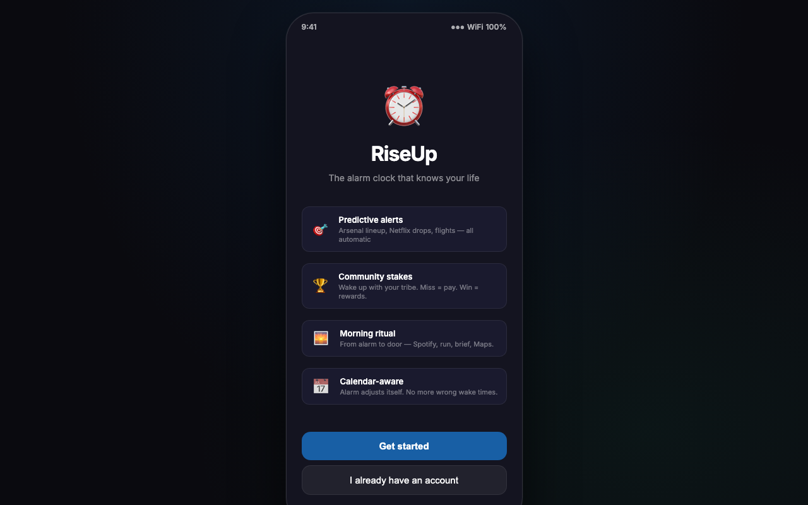

# RiseUp — Smart Alarm & Morning Routine App

**Context-Aware Alarm & Daily Routine Builder for Productive Mornings · Built with React**

🔗 [Live App](https://riseup-app-eight.vercel.app)

---



---

## Overview

RiseUp is a smart alarm and morning routine management app that helps users start their day with intention. Beyond a standard alarm, it offers context-aware wake triggers, a morning OS for building daily habits, community accountability through Tribe Rise, and smart alerts that adapt to your schedule — turning the first 30 minutes of the day into a structured, motivated routine.

---

## Problem Statement

Standard alarm apps do one thing — ring at a set time — but do nothing to help users actually get up, stay consistent, or build a productive morning. Most people snooze their way through the most high-leverage part of their day. There was a gap for an app that combined smart wake logic, routine scaffolding, and social accountability in a single experience.

---

## User Flow

```
New user opens app
        │
        ▼
Onboarding flow (4 steps)
  ├── Wake preference & goals
  ├── Routine preferences
  ├── Tribe / accountability setup
  └── Paywall (premium unlock)
        │
        ▼
Home screen — Alarm management
  └── Set, edit, and manage alarms
        │
        ▼
Smart features
  ├── Context Wake — trigger-based smart alarms
  ├── Smart Alerts — adaptive daily notifications
  ├── Morning OS — daily routine builder
  └── Tribe Rise — community accountability feed
        │
        ▼
Alarm rings → contextual wake experience
  └── Motivational prompt · Day brief · Routine kickoff
```

---

## Tech Stack

| Component | Technology |
|---|---|
| Frontend Framework | React 18 |
| Build Tool | Create React App |
| Styling | Plain CSS (per-screen stylesheets) |
| Routing | React state-based screen navigation |
| Deployment | Vercel |
