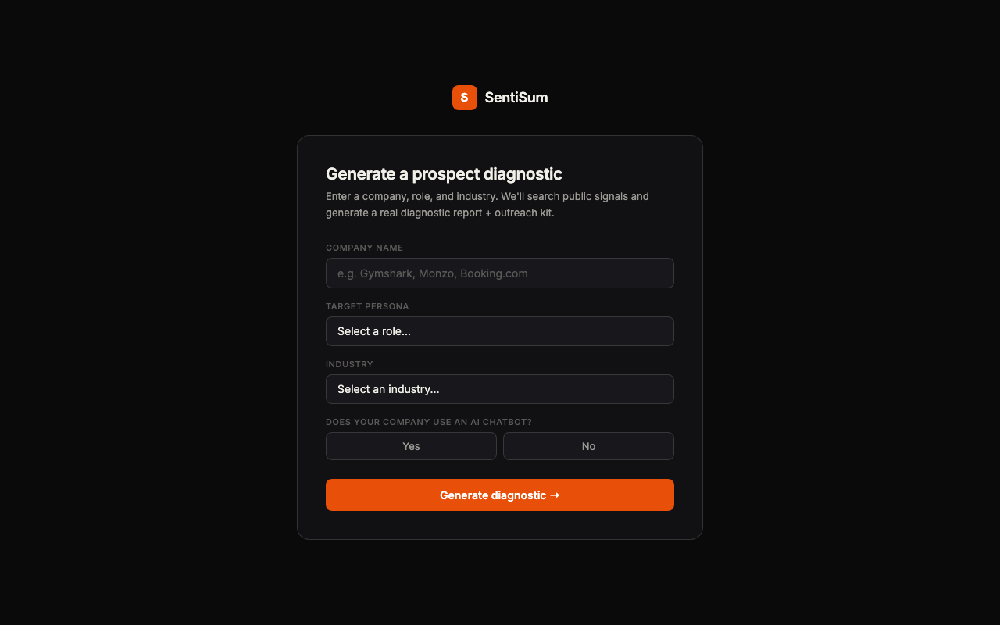

# Sentisum CX Diagnostic — Prospect Intelligence Tool

**AI-Powered CX Research & Cold Outreach Generator · Built on Vercel**

🔗 [Live App](https://sentisum-cxdiagonistics.vercel.app)

---



---

## Overview

A prospect diagnostic tool that generates real-time CX intelligence reports on target companies by scanning public signals — app store reviews, social media, news, and community forums. Sales reps get a full picture of a prospect's real customer experience challenges, plus a ready-to-use cold outreach kit with evidence-backed pain points and a draft personalised email.

---

## Problem Statement

Sales development reps at Sentisum were spending hours researching prospects manually before outreach — reading reviews, scanning LinkedIn, and guessing at pain points. There was no automated way to quickly surface what a company's customers were actually complaining about, making outreach generic and easy to ignore.

---

## User Flow

```
SDR opens the tool
        │
        ▼
Input: company name · persona · industry
        │
        ▼
Loading screen with step-by-step progress
  ├── Scanning app store reviews
  ├── Analysing social signals
  ├── Pulling news mentions
  └── Generating intelligence report
        │
        ▼
Full diagnostic report generated
  ├── Hero stats (review volume, sentiment score)
  ├── Key customer findings
  ├── Top issues & intent signals
  ├── What customers praise
  └── Automation & AI gap analysis
        │
        ▼
Outreach kit
  ├── Top 3 pain points with real customer quotes
  └── Draft personalised cold email
        │
        ▼
Share or download report · Previous searches in history
```

---

## Tech Stack

| Component | Technology |
|---|---|
| Frontend | Vanilla HTML + CSS + JavaScript |
| Backend | Serverless API endpoint (`/api/generate`) |
| Data Persistence | LocalStorage (search history) |
| Deployment | Vercel |
